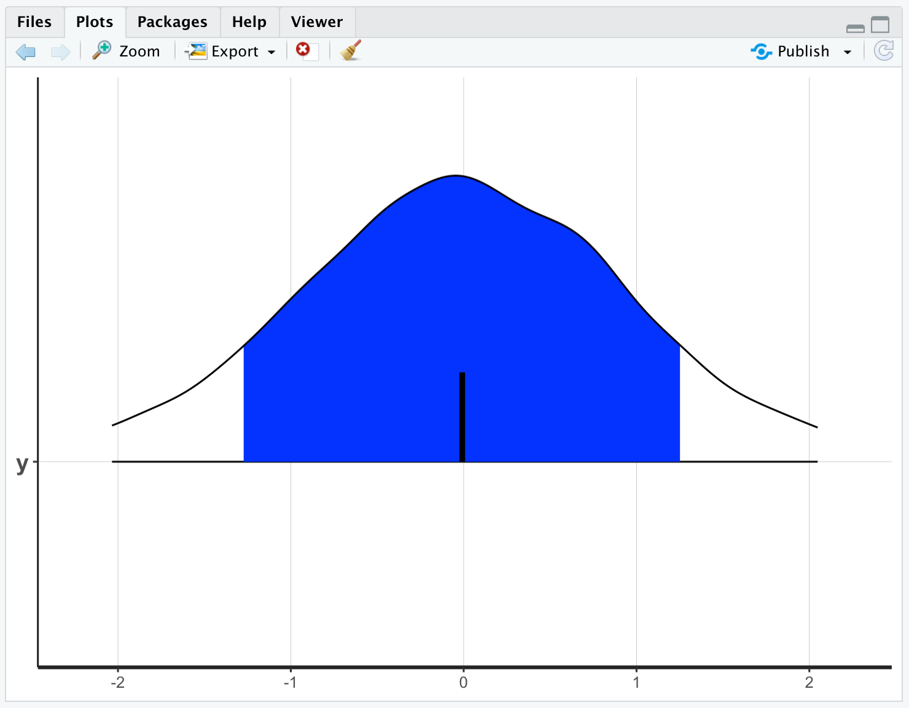

```{r setup, include=FALSE}
knitr::opts_chunk$set(echo = TRUE, eval = FALSE)
```

# Overview
So you want to do some Bayesian inference? Well, you'll need some software. If you are reading this, you should already have [R](https://cran.r-project.org/) and [RStudio](https://www.rstudio.com/products/rstudio/download/) installed on your computer (**MAKE SURE YOU HAVE `R` VERSION 4.0 OR HIGHER**). This document will help you get started with a new piece of statistical software: [Stan](https://mc-stan.org/). Here are the steps to install this new software.


# Step 1: Configure your Computer for C++
Unlike R, code in Stan requires that your computer be able to compile code.


## Compiling Code on Windows
These steps are from [here](https://github.com/stan-dev/rstan/wiki/Configuring-C---Toolchain-for-Windows). You first want to ensure that you have the right Windows environment variables for R:
```{r}
Sys.getenv("BINPREF")
```

The code above should return `""` at this point in the install process.

Now, install [Rtools](https://cran.r-project.org/bin/windows/Rtools/). You will also set another R environment variable using the code below:
```{r}
writeLines('PATH="${RTOOLS40_HOME}\\usr\\bin;${PATH}"', con = "~/.Renviron")
```

After you run this code, restart RStudio, and check that your system path has been updated.
```{r, eval=FALSE}
Sys.which("make")
```

The code above should return `"C:\\rtools40\\usr\\bin\\make.exe"`.


## Compiling Code on Mac


### All-in-One Option
These steps are from [here](https://github.com/rmacoslib/r-macos-rtools). Because this process downloads Xcode, it may take some time (and I recommend that you use an ethernet internet connection if possible). First, download the file `macos-rtools-4.0.0.pkg` file to your desktop (your version may be later than 4.0.0). **Right-click** (two-finger click) on the package and select **Open with >** and choose "Installer.app". Click through the prompts. **Go take a long lunch while it installs.**

### Step-by-Step Option
If the install process above does not work (it did not work for me), then you will need to install Xcode and a Fortran compiler on your own. I will walk you through the steps I used.

- Install Xcode from the [App Store](https://apps.apple.com/us/app/xcode/id497799835?mt=12); this may take a while, so **go have lunch and come back**.
- Open your **Terminal** (Applications > Utilities > Terminal), type `xcode-select --install`, and press Enter
- Find your operating system (Apple Button > About This Mac). For example, I am currently using **macOS Big Sur v. 11.6.1** with an **Intel Core i7** processor.
- Download the OS- and processor-specific `gFortran` [compiler for macOS](https://github.com/fxcoudert/gfortran-for-macOS/releases). For example, because I have an Intel chip and am using Big Sur, I download `gfortran-Intel-11.2-BigSur.dmg`.
- Open the disk image and find the `gfortran.pkg` file. Open it, and go through the installation steps.
- Finally, go back to your **Terminal**, type `export PATH=$PATH:/usr/local/gfortran/bin`, and press Enter.

To see if you were successful, check that your system path has been updated.
```{r, eval=FALSE}
Sys.which("make")
```

The code above should return `"/usr/bin/make"`.


## Installing Stan for R
We will now follow [these steps](https://github.com/stan-dev/rstan/wiki/RStan-Getting-Started) (skipping to section "Installation of RStan").

- Restart RStudio
- Run the code below:
```{r}
install.packages("rstan", repos = "https://cloud.r-project.org/", dependencies = TRUE)
```
- This also installs some other helpful packages for doing Bayesian analysis and working with Stan in R, such as `StanHeaders::`, `shinystan::`, `bayesplot::`, `rstantools::`, and `V8::`.
- Run the basic RStan example to check that everything works:
```{r}
example(stan_model, package = "rstan", run.dontrun = TRUE)
```
You will see **A LOT** of output to the console. At the end of it all, you should see two copies of four "chains" in your console. In your environment, there should be four objects: `fit`, `fit2`, `mod`, and `stancode`.  

- Plot the example's posterior distribution (more on what this means later in the semester):
```{r}
plot(fit, show_density = TRUE, fill_color = "blue")
```


